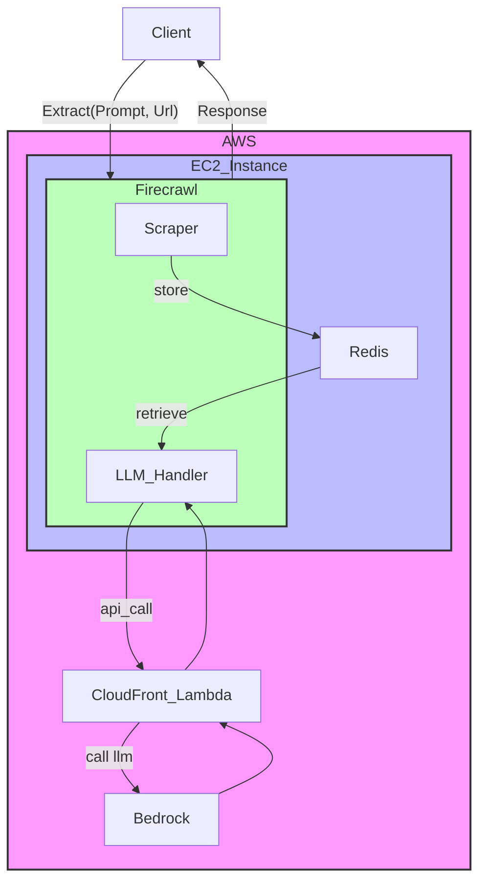

```mermaid
graph TD;
    Client -- Extract(Prompt, Url) --> Firecrawl;
    
    subgraph AWS
        subgraph EC2_Instance
            subgraph Firecrawl
                Scraper
                LLM_Handler
            end
            Redis
        end
        CloudFront_Lambda
        Bedrock
    end
    
    Firecrawl -- Response --> Client;
    LLM_Handler -- api_call --> CloudFront_Lambda;
    CloudFront_Lambda -- call llm --> Bedrock;
    Bedrock --> CloudFront_Lambda;
    CloudFront_Lambda ---> LLM_Handler;
    Scraper -- store --> Redis;
    Redis -- retrieve --> LLM_Handler;

    style AWS fill:#f9f,stroke:#333,stroke-width:2px;
    style EC2_Instance fill:#bbf,stroke:#333,stroke-width:2px;
    style Firecrawl fill:#bfb,stroke:#333,stroke-width:2px;
```